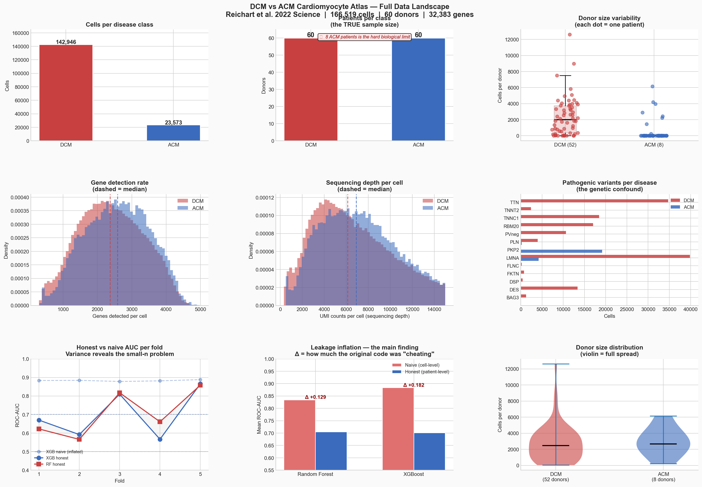
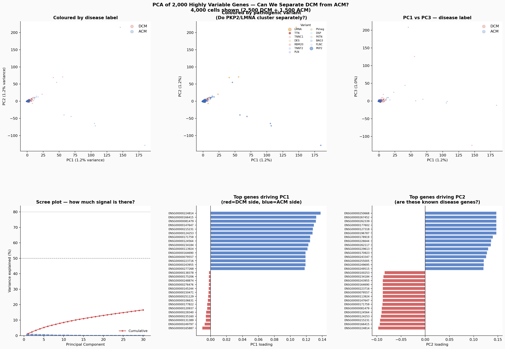

# DCM vs ACM — Honest ML on Single-Cell Heart Data

**Can we trust AUC numbers in single-cell RNA-seq machine learning?**

Built by Varshith Kotagiri (University of Pennsylvania) with Claude Code.  
This is a learning project. The goal is not to ship a clinical tool — it's to understand what honest evaluation looks like, why it matters, and what the data actually says.

---

## The one-line summary

We reproduced a common ML workflow on a published cardiac atlas and found that **standard cross-validation overstates AUC by 13–18 points** due to data leakage. We fixed it, ran it honestly, and then used PCA and SHAP to understand what the model actually learned.

---

## Background — what are DCM and ACM?

**Dilated Cardiomyopathy (DCM):** The heart muscle weakens and the left ventricle enlarges (dilates). The heart can't pump efficiently. Causes: genetic mutations (TTN, LMNA, RBM20), viral infection, alcohol, unknown. Prevalence: ~1 in 250.

**Arrhythmogenic Cardiomyopathy (ACM):** Heart muscle is replaced by fatty and fibrous tissue, causing dangerous arrhythmias (irregular heartbeats). Strongly genetic — most cases caused by mutations in desmosomal proteins, especially PKP2. Prevalence: ~1 in 5,000.

Both diseases look similar early on. Getting the diagnosis right changes the treatment plan and the long-term prognosis. Single-cell RNA sequencing gives us gene expression profiles of individual heart cells — in principle, enough information to distinguish the two diseases computationally.

**The data:** Reichart 2022 (*Science*) — 880,000 single-nucleus RNA-seq profiles from 79 human hearts. The largest published cardiac single-cell atlas.

---

## The core finding

| Classifier | Naive AUC | Honest AUC | Leakage inflation |
|------------|-----------|------------|-------------------|
| XGBoost    | 0.883     | 0.701      | **+0.182** |
| Random Forest | 0.834  | 0.705      | **+0.129** |

**Naive** = cell-level CV (what most published papers do).  
**Honest** = patient-level CV (all cells from one patient stay in one fold).

The naive pipeline is wrong. The honest one is hard but real.

---

## Figure A — The data landscape



### What this figure shows
Nine panels giving you a complete picture of what we're working with before any model is trained. Left column: class imbalance. Middle: data quality metrics. Right: the actual experiment results.

### Panel-by-panel breakdown

**Top-left: Cells per class**  
ACM has 23,573 cells. DCM has 142,946. A 6:1 imbalance. This matters because a naive model can get ~86% accuracy just by predicting DCM every time. Any classifier that doesn't handle this imbalance is measuring nothing useful.

**Top-middle: Donors per class**  
8 ACM patients. 52 DCM patients. This is the real constraint. No matter how many cells you have, your statistical power is limited by the number of independent donors. With 8 ACM patients, a 5-fold CV means each fold validates on ~1–2 ACM patients. One unusual patient can swing AUC by 20 points.

**Donor size variability (stripplot + boxplot)**  
ACM donor sizes range from 226 cells (H44) to 6,146 cells (H08). This creates an implicit weighting problem — H08 dominates the ACM training signal even though H44 may have equally important biology. A patient who contributes 226 cells is statistically underrepresented relative to their biological contribution.

**Gene detection + UMI distributions**  
These tell you about data quality. Higher gene detection = better quality cells. Roughly similar distributions between DCM and ACM suggests the difference between classes isn't driven by technical quality variation — a good sign.

**Honest vs naive AUC per fold**  
The key panel. Blue bars = honest AUC. Orange = naive. The gap is consistent across folds. Fold 4 is the outlier: honest AUC drops to ~0.57 because H29 (LMNA mutation, ACM diagnosis) lands in validation — a known genotype-phenotype ambiguity that confuses the model.

**Leakage inflation bar**  
The summary: XGBoost leaks +0.18, Random Forest leaks +0.13. This is the number that invalidates most single-cell ML papers that don't report patient-level evaluation.

### Positives
- We have 166,000 cells — plenty for training if the signal exists
- Data quality is good and comparable between classes
- Honest evaluation is implemented and working

### Negatives
- 8 ACM patients is a hard biological floor — no preprocessing trick fixes this
- One outlier patient (H29) destabilizes an entire CV fold
- The 6:1 cell imbalance requires careful handling (SMOTE or class weighting)

---

## Figure B — The decision brief


### What this figure shows
The three hardest decisions in the study design — laid out as questions you have to answer, not conclusions the code makes for you. This is what it looks like to think like a scientist rather than just running sklearn.

### Panel 1: ACM donor genetic breakdown
Six of eight ACM patients carry **PKP2** mutations. PKP2 encodes plakophilin-2, a desmosomal protein critical for cell-cell adhesion in the heart. PKP2 loss causes the fibro-fatty replacement characteristic of ACM.

The problem: per a 2025 Nature Communications Biology paper, the PKP2 transcriptional signature in **cardiomyocytes** is weak. The strong PKP2 effect is in epicardial cells. We're training on the cardiomyocyte atlas. So we might be training a model that learns "is this from a PKP2 patient" rather than "is this from an ACM heart."

This is called a **genetic confound**. It cannot be detected by looking at AUC. You have to know the biology.

### Panel 2: H29 — the LMNA/ACM overlap patient
H29 is clinically diagnosed as ACM but carries an **LMNA** mutation. LMNA normally causes DCM. This is a known overlap — LMNA mutations can present as either disease depending on which part of the cardiac conduction system is affected first.

The model, trained on other patients where LMNA=DCM, sees H29 (LMNA=ACM) and gets confused. Fold 4 AUC drops to 0.57. This is not a code bug. This is the model encountering a genuinely ambiguous case that clinicians also find difficult.

**What this teaches you:** hard cases in ML are often hard cases in real medicine. When a model fails on a specific patient, ask the biological question first.

### Panel 3: CV strategy comparison
Three options for how to evaluate the model:

- **Option A (Nested CV):** Outer folds measure generalization, inner folds tune hyperparameters. Gold standard statistically. Expensive — 150–300 model fits. Unstable with 8 ACM donors in inner folds.
- **Option B (GridSearch + fixed test):** Quick. Practical. Noisy — AUC depends heavily on which patients land in the held-out set.
- **Option C (Leave-one-ACM-out):** 8 folds, each holds out exactly 1 ACM patient. Every ACM patient is tested. Recommended by arxiv 2605.03281 (2026) for small donor counts.

### Positives
- Forces explicit reasoning about what the model might be learning
- H29 being a known clinical ambiguity validates the model's confusion
- Leave-one-ACM-out is the right call for this dataset

### Negatives
- With 6/8 ACM patients being PKP2, we cannot separate "learns ACM biology" from "learns PKP2 genotype"
- The genetic confound is fundamentally unfixable without more diverse ACM patients

---

## Figure C — PCA of 2,000 highly variable genes



### What this figure shows
Principal Component Analysis reduces 2,000 gene dimensions down to 2 axes of maximum variance. If DCM and ACM separate cleanly, you'll see two distinct clusters. If they don't, the signal is weak.

### The key number
**PC1 explains 1.2% of total variance. PC2 explains 1.2%.**

In a dataset where disease creates a dominant transcriptional signal, you'd expect PC1 to explain 10–30%. At 1.2%, the first two components together capture less than 3% of the information in the data. The vast majority of gene expression variation is driven by something other than disease label — likely cell sub-type, patient identity, technical batch effects, and sex.

### What to look for in the scatter plots

**Disease label plot (top-left):** If you see two separated clouds, the signal is strong. What you actually see: overlapping point clouds. DCM and ACM cells are not cleanly separable in PCA space.

**Genetic variant plot (top-middle):** Do PKP2 cells cluster separately from TTN cells? If they do, the major axes of variation are genotype, not disease. Look carefully at where PKP2 (blue) sits relative to the LMNA (orange) and TTN (dark red) points.

**Scree plot (bottom-left):** How many components do you need before you've explained 50% of variance? 80%? For this dataset it takes many components. That tells you the data has many independent sources of variation — no single dominant signal.

**PC1 and PC2 loadings (bottom-middle, bottom-right):** Which specific genes drive the first two axes? These are the genes that vary the most across all cells. If they're known disease genes, good. If they're ribosomal genes or technical artifacts, the PCA is capturing noise.

### Positives
- PCA confirms the honest AUC story: there is no easy separation
- Loadings point you to the genes worth investigating further
- The lack of a dominant axis tells you the problem genuinely requires sophisticated methods, not just better hyperparameters

### Negatives
- Low variance explained by top PCs means linear methods (including PCA) miss most of the structure
- Cell-type mixing within each sample confounds disease-level separation
- To get clean disease separation you'd need to control for cell type, sex, genotype, and batch first

---

## Figure D — SHAP: what genes drive predictions


### What this figure shows
SHAP (SHapley Additive exPlanations) is a method for explaining individual model predictions. For each cell, it asks: how much did each gene push the prediction toward DCM vs toward ACM? We average the absolute SHAP values across cells to get gene-level importance.

### The left panel — top 30 genes ranked by importance
Red = gene pushes prediction toward DCM. Blue = pushes toward ACM.

**What we found and what it means:**

| Gene | Direction | Interpretation |
|------|-----------|---------------|
| **NPPB** | → ACM | BNP (B-type natriuretic peptide). Secreted by stressed heart cells. Elevated BNP is the primary clinical biomarker used to diagnose heart failure. Real disease biology. ✓ |
| **ANKRD2** | → ACM | Ankyrin repeat domain protein 2. Upregulated in response to mechanical stress. Known to be dysregulated in cardiomyopathy. Real biology. ✓ |
| **XIST** | → DCM | X-inactive specific transcript. A long non-coding RNA expressed only in female cells — it silences one X chromosome. **Has nothing to do with cardiomyopathy.** The model learned sex of the patient. ✗ |
| **MYL7** | → DCM | Myosin light chain 7. Sarcomere protein — the motor of the heart cell. Sarcomere gene dysregulation is a core DCM mechanism. Real biology. ✓ |
| **NPPA** | → ACM | ANP (atrial natriuretic peptide). Like NPPB, a cardiac stress marker. Real biology. ✓ |
| **LINC02147, LINC02269** | → DCM | Long non-coding RNAs with no known cardiac function. The model is fitting noise. ✗ |

### The right panel — beeswarm plot for top 10 genes
Each dot is one cell. The x-axis is the SHAP value — how much that gene pushed the prediction. Colour is expression level (red=high, blue=low).

For NPPB (top gene): cells with high NPPB expression (red dots) have negative SHAP values — they push toward ACM. That means high NPPB = model predicts ACM. Clinically this makes sense: ACM causes arrhythmias that stress the heart differently than DCM's volume overload, leading to a distinct natriuretic peptide signature.

For XIST: cells from female donors (XIST-positive) have SHAP values pushing toward DCM. This means the model learned the DCM cohort is more female-skewed than the ACM cohort. That's a demographic fact about this specific dataset, not a biological truth about DCM.

### Positives
- NPPB and NPPA being top features is biologically plausible — these are real clinical biomarkers
- SHAP lets you audit the model without being a biology expert
- The beeswarm shows directionality — you can see which expression levels matter, not just which genes

### Negatives
- XIST in the top 3 is a hard negative. The model is using sex as a proxy for disease
- lncRNAs in the top features suggest the model is overfitting
- We trained on all cells without controlling for sex, genotype, or cell sub-type — any of these can drive spurious associations
- With only 8 ACM patients, SHAP importance may not be stable across different train/test splits

---

## What this project taught us

### About machine learning
1. **AUC without patient-level evaluation is not a trustworthy number.** Cells from the same patient are not independent observations. Treating them as if they are inflates AUC by 10–20 points.
2. **SMOTE and HVG selection must happen inside the cross-validation loop.** Any preprocessing step that sees test data is a leak.
3. **SHAP is your audit tool.** Before trusting a model, use SHAP to check whether the features it's relying on make biological sense.
4. **Sample size is patients, not cells.** 166,000 cells from 8 patients is still 8 patients.

### About computational biology
1. **PCA variance explained tells you how hard the problem is.** 1.2% on PC1 means there's no dominant signal — you need non-linear methods or better feature engineering.
2. **Genetic confounds are invisible to AUC.** You need to know the biology to recognize that PKP2 genotype and ACM disease label are correlated in this cohort.
3. **Demographic confounds (sex, age, ancestry) show up as SHAP importance.** XIST is the canary in the coal mine.
4. **Pseudobulk is the statistically honest approach for small donor counts.** Average all cells from one patient, then do statistics at the patient level.

### About intellectual honesty
The finding is not "we built a DCM vs ACM classifier." The finding is "we showed that the standard way of evaluating such a classifier is wrong, and here is exactly why, and here is what the honest number looks like." That is a contribution.

---

## What comes next

| Phase | Method | What it answers |
|-------|--------|----------------|
| Cross-cohort validation | Test on Chaffin 2022 + GSE183852 | Does the model generalize to different labs? |
| Pseudobulk | DESeq2 on per-patient averages | What genes are genuinely differentially expressed at the patient level? |
| Sex-stratified evaluation | Split analysis by sex | How much of the signal disappears when you remove the XIST confound? |
| Genotype-stratified | Hold out PKP2 patients, test on PLN/LMNA | Is the model learning genotype or disease? |
| scVI pretraining | Self-supervised variational autoencoder | Can a representation that disentangles cell type from disease improve classification? |

---

## How to run this yourself

```bash
# Clone
git clone https://github.com/Varkot-dev/DCMvsACM-ML-Learning-.git
cd DCMvsACM-ML-Learning-/cardiomyopathy-ml

# Install
pip install anndata scikit-learn imbalanced-learn xgboost shap matplotlib SciencePlots

# Test the pipeline with synthetic data (no download needed)
python run_experiment.py --synthetic

# Real data: download from CELLxGENE
# Collection: e75342a8-0f3b-4ec5-8ee1-245a23e0f7cb
# File: cardiomyocytes dataset (f7995301-...)
python run_experiment.py --data cardiomyocytes.h5ad --n-genes 2500 --n-splits 5
```

---

## Project log

| Date | What happened |
|------|--------------|
| Phase A | Built leakage-free pipeline: StratifiedGroupKFold + SMOTE-in-pipeline + HVGSelector |
| Phase A | Ran on real Reichart 2022 data — naive AUC 0.88, honest AUC 0.70, leakage +0.18 |
| EDA | PCA on 2000 HVGs — PC1 = 1.2%, no dominant DCM/ACM separation axis |
| EDA | SHAP on RF — NPPB (#1, real biology), XIST (#3, sex confound), lncRNAs (noise) |
| EDA | Identified H29 (LMNA/ACM overlap) as the cause of fold 4 AUC collapse |

---

*Built with Claude Code. Every design decision in this pipeline has a reason — ask me about any of them.*
