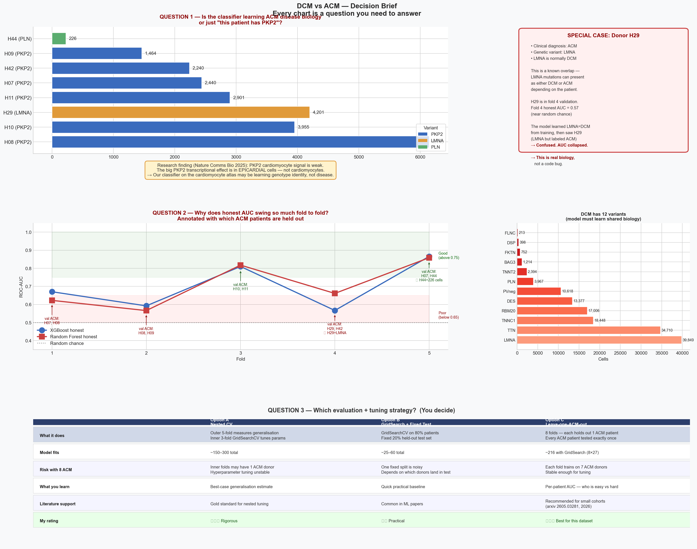

# July 4, 2026

The question I started with: can a machine learning model distinguish dilated cardiomyopathy from arrhythmogenic cardiomyopathy using single-cell gene expression? The dataset is the Reichart 2022 *Science* atlas — 880,000 nuclei from 79 human hearts, the largest published cardiac single-cell resource.

The answer turned out to be more complicated than I expected, and more interesting.

---

## The finding

I built a standard classifier — Random Forest and XGBoost on 2,500 highly variable genes — and evaluated it two ways. The first way is how most papers do it: split cells randomly into training and validation. The second way is the correct way: keep all cells from the same patient together, so the model is always tested on patients it has never seen.

| Classifier | Standard CV | Patient-level CV | Difference |
|------------|-------------|-----------------|------------|
| XGBoost    | 0.883       | 0.701           | **−0.182** |
| Random Forest | 0.834    | 0.705           | **−0.129** |

Eighteen AUC points. That gap exists because the standard approach lets the model memorize individual patients rather than learning disease biology. A patient contributes 2,000–6,000 cells. When 80% of those cells are in training and 20% are in validation, the model recognizes the patient — not the disease. The validation score is inflated by design.

This isn't a subtle problem. It's the difference between a model that looks publishable and a model that actually generalizes.

---

## Three specific bugs I fixed

**Cell-level cross-validation.** The fix is `StratifiedGroupKFold` with `groups=donor_id`. Every cell from donor H08 stays in the same fold. The model is evaluated only on donors it has never trained on.

**SMOTE applied before splitting.** SMOTE generates synthetic minority-class cells by interpolating between real ones. If you run it before splitting, synthetic cells derived from validation patients leak into training. The fix is wrapping SMOTE inside an `imblearn.Pipeline` — it runs only on training data and is skipped entirely at prediction time.

**Gene selection before splitting.** Picking highly variable genes on the full dataset means test cells influenced which genes were selected. The fix is a custom `HVGSelector` transformer that fits only on training folds.

---

## The memory problem

The full expression matrix — 166,519 cells × 32,383 genes as dense float64 — requires about 40 GB of RAM. My laptop has 16. I wrote a sparse Fano-factor pre-selection that computes variance/mean on the sparse matrix before converting to dense, reducing peak memory to ~1.6 GB. The Fano factor (variance divided by mean) is a standard measure of gene variability that works correctly on sparse count data without needing to densify first.

---

## What the data actually looks like

Eight ACM patients. Fifty-two DCM patients. That asymmetry is the hard biological constraint everything else runs into. No preprocessing step, no oversampling method, no architecture choice changes the fact that the model is learning from eight independent ACM donors.

Fold 4 makes this concrete: donor H29 has an LMNA mutation but a clinical ACM diagnosis. LMNA normally causes DCM. The model, trained on other patients where LMNA predicts DCM, sees H29 in validation and gets it wrong. Fold 4 AUC drops to 0.57 — near chance. That's not a bug. That's a known genotype-phenotype ambiguity that cardiologists also find difficult.

---

## Figures

### Data landscape
Nine panels: class imbalance, donor counts, donor size variability, gene detection distributions, UMI depth, pathogenic variant breakdown, honest vs naive AUC per fold, leakage inflation summary, donor size violin.

### Design decisions
The three questions I had to answer before moving forward: is the model learning genetics or disease biology, why does fold 4 collapse, and which cross-validation strategy fits a cohort with eight ACM patients.

