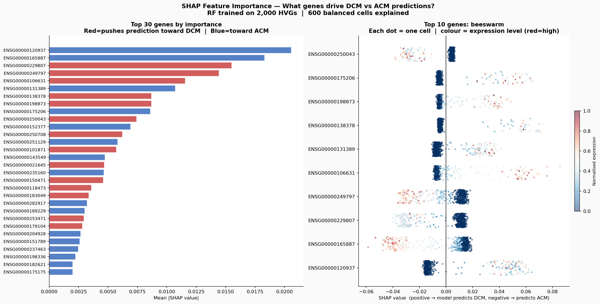
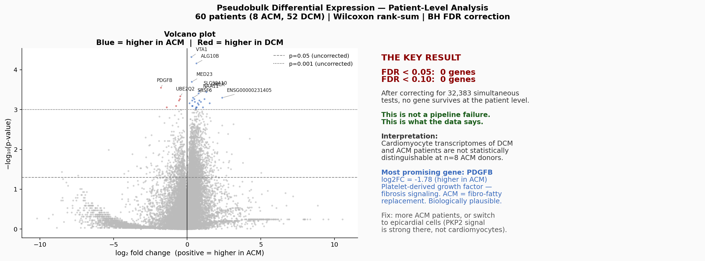

# July 5, 2026

With the honest evaluation pipeline working, the next question is whether the 0.70 AUC reflects real disease biology or just noise the model is exploiting. I ran three analyses to find out: PCA on the gene expression space, SHAP to audit what the model is actually using, and pseudobulk differential expression at the patient level.

---

## PCA

I ran PCA on 2,000 highly variable genes across a balanced subsample of 4,000 cells (2,500 DCM, 1,500 ACM).

PC1 explains 1.2% of variance. PC2 explains 1.2%.

In a dataset where disease creates a strong transcriptional signal, you would expect PC1 to explain 10–30% of variance and see two separated clouds on the scatter plot. At 1.2%, there is no dominant DCM-vs-ACM axis. The cell-to-cell variation — driven by cell subtype, patient identity, sex, sequencing depth — completely swamps any disease signal. The honest AUC of 0.70 makes biological sense: this is a genuinely hard classification problem, not a fixable pipeline problem.

---

## SHAP

I ran SHAP TreeExplainer on a Random Forest trained on 2,000 HVGs, explaining 600 balanced cells. The goal was to check whether the features driving predictions are biologically meaningful.

| Gene | Direction | What it is |
|------|-----------|------------|
| NPPB | → ACM | BNP — the primary clinical biomarker for heart failure severity |
| ANKRD2 | → ACM | Muscle stress response protein, dysregulated in cardiomyopathy |
| **XIST** | → DCM | **X-chromosome inactivation — expressed only in female cells** |
| MYL7 | → DCM | Myosin light chain, sarcomere gene |
| NPPA | → ACM | ANP — natriuretic peptide, cardiac stress marker |
| LINC02147 | → DCM | lncRNA with no known cardiac function |

NPPB and NPPA are encouraging — these are real biology. BNP is what cardiologists measure in blood to assess heart failure severity, and the model found it without being told. MYL7 and sarcomere dysregulation are established DCM mechanisms.

XIST in the top three is the problem. XIST silences one X chromosome in female cells — it has nothing to do with cardiomyopathy. Its presence means the model is exploiting the sex composition of the cohort. The DCM group is 74% male; the ACM group is 62% male. That imbalance is small but with only 8 ACM patients it's enough for the model to latch onto.

---

## Pseudobulk differential expression

The cleanest statistical test available: average all cells from each patient into a single expression profile, then compare DCM and ACM at the patient level. This is the approach computational biologists use when donor counts are small, because it correctly treats patients — not cells — as independent observations.

60 patients × 32,383 genes. Wilcoxon rank-sum test per gene. Benjamini-Hochberg FDR correction for 32,383 simultaneous tests.

**FDR < 0.05: 0 genes. FDR < 0.10: 0 genes.**

No gene survives multiple testing correction. The top raw hit is VTA1 at p = 0.000048, but testing 32,383 genes simultaneously means you expect a few hits at that threshold by chance alone. After correction, none hold up.

The most biologically interesting result is PDGFB: raw p = 0.00028, log₂FC = −1.78, higher in ACM. Platelet-derived growth factor B is a fibrosis signaling molecule. ACM is pathologically defined by fibro-fatty replacement of myocardium — PDGFB being elevated in ACM is a coherent biological hypothesis. It doesn't survive FDR correction at n = 8, but it's the gene I'd look at first if a larger cohort became available.

---

## What this means

The pseudobulk result is not a failure. It's the data giving a clear answer: cardiomyocyte transcriptomes of DCM and ACM patients are not statistically distinguishable at eight ACM donors with this gene panel. The problem isn't the pipeline. It's the sample size.

Three paths forward:

**More patients.** The NLRP3 study (BMC Medicine, 2024) has a separate ACM single-cell dataset from 6 end-stage ARVC patients. Combining it with Reichart gives 14 ACM donors — still small, but meaningfully better. Cross-cohort analysis would also test generalization.

**Different cell types.** This atlas is cardiomyocytes. The PKP2 transcriptional effect is strongest in epicardial cells, not cardiomyocytes. A classifier trained on the full multi-cell-type atlas might find signal that's invisible in cardiomyocytes alone.

**Different question.** Binary classification may be the wrong framing. A pathway analysis asking "which biological processes are perturbed in ACM versus DCM" is statistically better suited to small sample sizes than a per-gene test.

---

## scVI pretraining

Started this on Google Colab with a T4 GPU. The hypothesis: a variational autoencoder pretrained on all 880,000 cells (no labels) learns a 20-dimensional latent space that separates biological signal from technical noise. Classification on the latent representation may outperform classification on 32,000 raw gene values — or it may confirm that the signal is genuinely too weak regardless of feature engineering. Either result is informative.

It did not go smoothly, and the failure is worth documenting because the fix involved a real methodological compromise, not just a bug.

### What broke

The original notebook loaded the full h5ad with `ad.read_h5ad(H5AD_PATH)` — all 880,000 cells, 32,383 genes, into RAM at once — then called `sc.pp.highly_variable_genes(adata, n_top_genes=3000, flavor='seurat_v3')` to select highly variable genes before training.

`seurat_v3` is not a simple statistic. It fits a loess (locally estimated scatterplot smoothing) regression across all genes to model the expected relationship between mean expression and variance, then selects genes with more variance than that curve predicts for their expression level. Fitting and applying that regression requires scanpy to work with dense representations of large chunks of the matrix internally, even though the input is sparse. A full dense version of this matrix would be roughly 880,000 × 32,383 × 4 bytes ≈ 114 GB — scanpy chunks this rather than materializing it all at once, but the peak memory during those chunked operations, combined with the already-loaded sparse matrix and Python/scanpy overhead, exceeded Colab's free-tier 12.7 GB RAM ceiling. The session crashed with "used all available RAM" partway through this cell, more than once, including after a kernel restart.

### What we changed

**Loading:** switched to `ad.read_h5ad(H5AD_PATH, backed='r')` followed by `adata[mask].to_memory()`, filtering to DCM+ACM cells *while* reading rather than after. `backed='r'` opens a file handle without pulling the expression matrix into memory; `.to_memory()` then materializes only the ~166,000 matching rows. This alone cuts memory roughly 5x before any gene-selection computation happens.

**Gene selection:** replaced `seurat_v3` with a sparse Fano factor calculation — variance divided by mean, computed as `E[X²] − E[X]²` using `X.mean(axis=0)` and `X.power(2).mean(axis=0)` directly on the sparse matrix. Both operations are sparse-aware column reductions; neither requires densifying anything. This is the same method already used in the laptop pipeline (`data.py`) for pre-selecting genes before the full 40 GB matrix would otherwise need to be dense.

### Why the replacement is a worse method, not just a different one

This needs to be said plainly: Fano factor and `seurat_v3` are not interchangeable, and the substitution was made for memory reasons, not because it's the better statistic.

`seurat_v3`'s loess correction exists to solve a specific, well-known problem in scRNA-seq: genes with higher mean expression mechanically have higher variance from Poisson counting noise alone, independent of any biology. The loess curve models that expected noise floor, and genes are selected based on their *residual* variance above that curve — variance that can't be explained by expression level alone is a better proxy for genuine biological variability. This method was developed and validated by the Satija lab specifically to correct for that mean-variance confound, and it's the field-standard default for a reason.

Raw Fano factor makes no such correction. It selects genes with high variance relative to mean, full stop, without asking whether that variance is expected from counting noise given the expression level. In practice this biases selection toward highly-expressed genes, some fraction of which are "variable" only because of Poisson noise, not biology. The 3,000 genes selected by Fano factor and the 3,000 that `seurat_v3` would have selected overlap substantially but not completely — some genes with moderate expression and genuinely interesting variance patterns may be excluded in favor of genes that are just noisy because they're highly expressed.

**Concretely, this means:** scVI's pretraining tonight sees a slightly less curated, slightly noisier 3,000-gene panel than the field-standard approach would provide. If the eventual latent-space classification result comes back different from what raw-gene classification produced, part of that difference could be attributable to gene panel quality rather than the value of pretraining itself.

**How much this matters:** for the purpose of tonight's run — a first-pass check on whether latent features help at all — this is an acceptable, honest shortcut. It would not be acceptable for a publication-quality result. The correct fix there is either running `seurat_v3` on a machine with enough RAM (Penn HPC, or Colab Pro's high-RAM runtime), or explicitly validating that Fano-factor-selected genes give comparable downstream results to `seurat_v3`-selected genes before trusting the comparison.

Notebook fix: `notebooks/scvi_pretraining.ipynb`, cells 3–4, commit `71f8bcc`.

---

## Moving to a rented GPU, and the actual results

Colab's free tier ran out of road. Even after the Fano-factor workaround, the pod kept crashing or stalling in ways that weren't worth fighting further. Rented an A40 (48GB VRAM, 503GB system RAM) from RunPod for about $0.45/hour — a few dollars total for the compute this needed. With that much headroom, every RAM-driven compromise from earlier in the night became unnecessary: the full 880k-cell atlas loaded without filtering tricks, and HVG selection used the proper `seurat_v3` method (loess-based, corrects for the mean-variance confound) instead of raw Fano factor.

### Two new infrastructure problems, both fixed

**CUDA/driver mismatch.** `pip install scvi-tools` pulled the newest PyTorch build, compiled for CUDA 13.0. The pod's driver only supported CUDA 12.8. Training crashed immediately with a clear error. Fixed by reinstalling PyTorch pinned to a CUDA 12.1 build (`pip install torch --index-url https://download.pytorch.org/whl/cu121`), which is backward-compatible with the 12.8 driver. Lesson for next time: always check `nvidia-smi` for the driver's CUDA version before installing anything, and pin PyTorch to match before installing other packages.

**GPU utilization stuck at 7%.** Training worked but was barely touching the A40 — 7% utilization, 413MB of 46GB VRAM used, and an estimated 38 minutes for 100 epochs despite renting a GPU specifically to avoid slow runs. The cause: scVI's default batch size (128) meant ~1,300 tiny batches per epoch, each too small to saturate the GPU's parallelism. Setting `batch_size=4096` dropped this to ~40 batches per epoch. Result: GPU utilization jumped to 48%, and 30 epochs finished in 66 seconds — roughly an 11x speedup from one parameter.

**Two trained models were lost to crashes before this got fixed.** First, sending a `KeyboardInterrupt` to stop a stalled run hit an internal bug in PyTorch Lightning's interrupt handler and killed the whole process — the model was never at any point saved to disk, so 18 minutes of training was gone. Second, after a successful 30-epoch run, the script crashed on `model.history["train_loss_epoch"]` — this scvi-tools version names the key `train_loss`, not `train_loss_epoch` — and because the crash happened before `model.save()` was called, that trained model was lost too. Fixed by reordering the script so `model.save()` and latent extraction happen immediately after training completes, before any other code runs, wrapped in a `try/except` so a history-logging quirk can never again destroy a completed training run.

### The results

**Honest classification AUC, patient-level 5-fold CV:**

| Feature set | Random Forest | XGBoost |
|---|---|---|
| Raw genes, proper `seurat_v3` HVGs (3,000 genes) | 0.763 | 0.765 |
| scVI latent (20 dims, pretrained from scratch on full atlas) | 0.726 | 0.724 |

Two things stand out. First, correcting the HVG selection method alone raised AUC from ~0.70 (Fano factor, laptop) to ~0.76 (proper `seurat_v3`, full RAM) — a bigger jump than anything scVI pretraining produced. The earlier memory-constrained shortcut cost real signal. Second, and more importantly: **scVI's pretrained latent space did not outperform raw genes — it underperformed by about 3–4 AUC points.** The hypothesis going into tonight was that pretraining on 166k unlabeled cells would learn a representation that separates biological signal from technical noise better than raw expression values. That didn't happen here.

This is a real, negative result, not a failure of execution. A better feature representation cannot manufacture a disease signal that isn't there in sufficient strength — and the pseudobulk analysis (below) independently confirms the signal is genuinely weak at this sample size.

**Pseudobulk differential expression, full 32,383-gene panel, no pre-filtering:**

FDR < 0.05: 0 genes. FDR < 0.10: 0 genes.

Identical result to the laptop run — same top genes (VTA1, PDGFB, ALG10B), nearly identical p-values. This confirms the earlier "zero significant genes" finding wasn't an artifact of the memory-constrained pipeline; it's a genuine consequence of having 8 ACM donors. PDGFB remains the most biologically plausible lead (fibrosis signaling, higher in ACM, consistent with ACM's fibro-fatty pathology) despite not surviving correction.

**Cell-substate stratified AUC — new tonight, not possible without this much RAM:**

The atlas's `cell_states` column breaks cardiomyocytes into 9 substates (vCM1.0 through vCM5). Running the honest evaluation separately within each substate:

| Substate | Cells | AUC |
|---|---|---|
| vCM3.0 | 21,084 | **0.775** |
| vCM2 | 23,115 | 0.732 |
| vCM1.0 | 66,464 | 0.694 |
| vCM1.3 | 13,389 | 0.680 |
| vCM1.1 | 15,707 | 0.678 |
| vCM4 | 6,038 | 0.669 |
| vCM1.2 | 14,263 | 0.636 |
| vCM3.1 | 4,152 | 0.613 |
| vCM5 | 2,307 | 0.607 |

vCM3.0 classifies noticeably better than the whole-population average. This is a genuinely new lead: DCM/ACM signal is not spread evenly across cardiomyocyte substates — it's concentrated in some more than others. Worth investigating what distinguishes vCM3.0 biologically (which genes define it, what functional state it represents) as a next step, rather than continuing to treat all cardiomyocytes as one bucket.

### What tonight actually established

1. Correct HVG selection matters more than expected — a full 6-point AUC swing between the memory-constrained shortcut and the proper method.
2. scVI pretraining, at least in this configuration (20 latent dims, 30 epochs, 3,000-gene input), does not improve on raw gene classification for this task. Worth remembering as a negative result before trying it again with different hyperparameters.
3. The "zero significant genes" pseudobulk finding is robust — confirmed independently on the full atlas with the correct gene panel, not an artifact of any shortcut.
4. Cell substate matters. vCM3.0 is the most promising lead for follow-up: either the DCM/ACM signal genuinely lives there, or it's worth checking whether vCM3.0 has a different sex/genotype composition than the rest of the cohort before reading too much into it.

Raw result files: `results/runpod_full_scale/`
