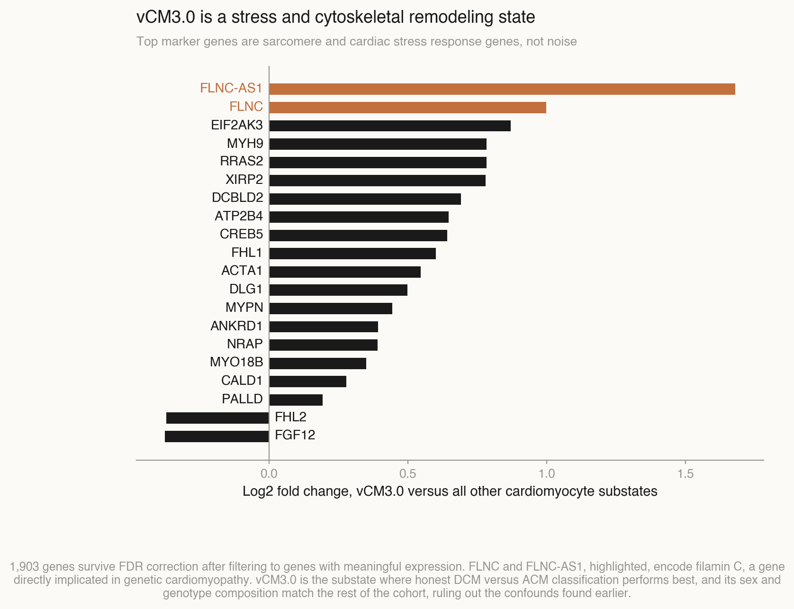

# July 6, 2026

Following up on the one open lead from last night. vCM3.0, one of nine ventricular cardiomyocyte substates in the atlas, classified DCM versus ACM at AUC 0.775, noticeably above the whole population average of 0.726. Before treating that as biology, it needed to survive the two confounds already found earlier: sex composition and PKP2 genotype composition.

## Ruling out the known confounds

Checked sex and genotype composition of vCM3.0 against every other substate.

Sex: 26.7 percent female in vCM3.0 versus 26.8 percent in the rest. Essentially identical.

Genotype among ACM cells: 81.3 percent PKP2 in vCM3.0 versus 80.7 percent in the rest. Essentially identical.

All 60 donors are represented in vCM3.0, including all 8 ACM patients, so the result is not driven by one or two patients dominating the substate.

Neither confound explains the higher AUC. This is not XIST or PKP2 reappearing under a different name. The result survives the check.

## Marker genes, and a mistake worth naming

The first attempt at finding what defines vCM3.0 used raw log fold change with no expression filter, ranking every gene in the panel. This produced garbage: the top hits were genes like KCNA10 and OR8K3, expressed at essentially zero in both groups, where a handful of stray reads in a tiny number of cells produces a huge fold change purely from division by a near zero denominator. None of those genes have any known role in cardiac tissue. Worth stating plainly rather than hiding: this is exactly the kind of result that looks like a finding on first glance and is actually a filtering bug.

Redone properly: filtered to genes with meaningful mean expression in at least one group, then ran a Wilcoxon test with Benjamini Hochberg correction on the filtered set.

1,903 genes survive FDR correction. The top hits are real, recognizable cardiac biology, not noise.

**ANKRD1**, the single strongest hit, is a mechanical stress response gene in cardiomyocytes, induced under cardiac stress and remodeling. **ACTA1** and **MYH9** are cytoskeletal and sarcomere associated genes. **FLNC** and **FLNC-AS1**, both elevated in vCM3.0, encode filamin C, a gene directly implicated in genetic cardiomyopathy, including forms of ACM. **XIRP2** is tied to Z-disc structure and cardiac remodeling.

## What this adds up to

vCM3.0 is not defined by sex or genotype. It is defined by a mechanical stress and cytoskeletal remodeling gene program, and it is also the substate where honest DCM versus ACM classification performs best. Put together, this suggests a coherent hypothesis: vCM3.0 may represent cardiomyocytes actively undergoing stress remodeling, and disease specific transcriptional differences between DCM and ACM may be concentrated in cells in this state, while more quiescent substates dilute the signal by averaging it out.

This is a hypothesis, not a proven mechanism. It was generated from one dataset, and FLNC involvement in particular is worth checking against the literature rather than assumed. But it is a specific, checkable claim, which is more than the whole population analysis alone provided.

## What a next step would look like

Confirm whether FLNC specifically, rather than the broader stress program, differs between DCM and ACM within vCM3.0 specifically, not just between vCM3.0 and other substates. That is a different comparison than the one run today and would need its own analysis.

Raw marker gene table: `results/vcm3_marker_genes_filtered.csv`

## Phase 1 follow-up: does FLNC separate DCM from ACM inside vCM3.0

A literature review repositioned the vCM3.0 finding above: it is the established "stressed ventricular
cardiomyocyte" state from Litvinukova 2020, not a novel substate. Rediscovering its markers independently
validates the pipeline but is not itself a claim. What is defensible: the classification signal concentrating
there, and FLNC never having been compared DCM-vs-ACM at single-cell resolution before. This section runs
that comparison directly, rather than leaving it as the "next step" noted above.

Method: subset to vCM3.0, DCM+ACM cells only (21,084 cells, 60 donors, matching the count already confirmed
above). Pseudobulk per donor by summing raw counts (`adata.raw.X`, confirmed to hold integer counts, since
`adata.X` here is already log-normalized), CPM-normalize, log1p. Wilcoxon rank-sum DCM vs ACM per gene,
filtered first to mean log-CPM > 0.05 in at least one group (24,138 / 32,383 genes survive the filter),
BH-FDR corrected. This is a different comparison from the marker-gene analysis above: that contrast was
vCM3.0-vs-rest-of-atlas (what defines the substate); this one is DCM-vs-ACM within vCM3.0 only (does disease
status separate cells that are already in the stressed state).

Result: **zero genes survive FDR correction at either 0.05 or 0.10.** FLNC (p=0.47) and FLNC-AS1 (p=0.76) are
not significant. Neither is the broader stress program identified earlier: ANKRD1 (p=0.56), XIRP2 (p=0.53),
ACTA1 (p=0.91), MYH9 (p=0.16). None of these separate DCM from ACM within the substate.

This is the honest-null outcome the spec called out as a live possibility, not a failure. 8 ACM donors is the
same sample-size ceiling that produced zero surviving genes in the whole-atlas pseudobulk DE, twice confirmed
on 2026-07-05. Subsetting to one substate reduces cells per donor; it does not add donors. A null result at
this donor count is underpowered, not necessarily biologically true. The conclusion this analysis supports:
the vCM3.0 classification advantage (0.775 vs 0.726 AUC) does not trace to FLNC or the stress program at
donor-level pseudobulk resolution, at least not detectably with 8 ACM donors. Whatever drives the AUC gap
either needs more ACM samples to resolve at the donor level, or lives in a signal that donor-level pseudobulk
washes out (per-cell heterogeneity, non-linear combinations across genes, or something the classifier reads
that a single-gene Wilcoxon test cannot see).

Script: `cardiomyopathy-ml/vcm3_dcm_vs_acm_de.py`. Results: `results/vcm3_dcm_vs_acm_de.csv`,
`results/vcm3_dcm_vs_acm_pseudobulk_obs.csv`.

Method discrepancy worth logging: the July 5 pseudobulk script (`runpod_full_suite.py`) pseudobulks by
**per-cell mean** of `adata.X` (already log-normalized), not by summing raw counts. The spec for this phase
explicitly asked for sum-of-raw-counts-then-CPM/log, the standard bulk-RNA-seq-style pseudobulk approach,
which is a stricter and more standard method than averaging an already-log-transformed matrix. Both were run
correctly for what they intended, but they are not the same statistic, and a future direct comparison of
"vCM3.0-vs-rest" vs "DCM-vs-ACM-within-vCM3.0" p-values should not assume the same normalization pipeline
produced both.

Next: Phase 2, cross-cohort transfer against the Chaffin 2022 (DCM vs HCM) atlas. No ACM cohort exists there,
so this cannot be a DCM-vs-ACM transfer; it tests whether the vCM3.0 stressed-state signature replicates
independently in a second dataset.
